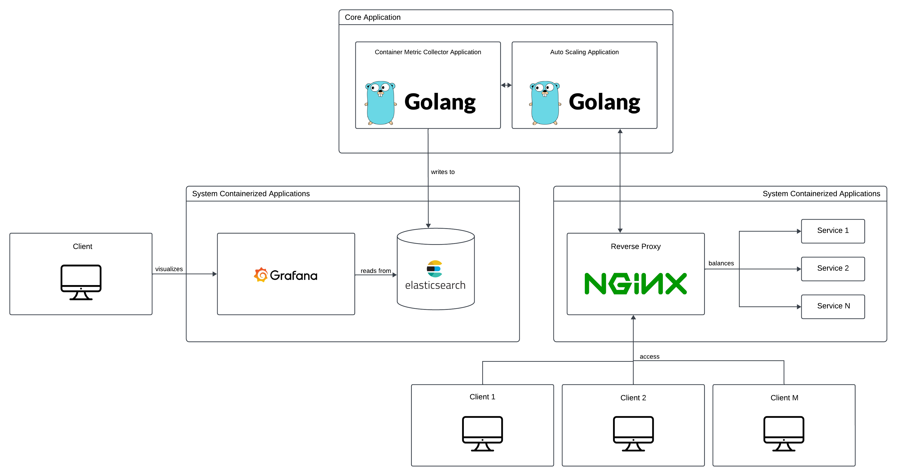

# GRS Project - Auto scaling containerized applications

## Goal

Containerized applications are everywhere today and the problem of scaling these applications became more important.

The goal of this project is to provide an easy to use solution to automatically scale containerized applications

## System Architecture

Here's the system architecture:



The main application runs 2 Go routines. One for the metric collector and the other to deal with the scaling. These 2 Go routines communicate with each other, so the scaler knows when it needs to up or downscale.

We will be using Nginx as a reverse proxy and as a load balancer. Whenever the system is up or downscaled, the Nginx config file is updated and a new worker is started running the updated config file.

The load balancer will never be down when updating the config file. We can do that by sending an ``HUP`` signal and Nginx deals with it by starting a new worker while the older ones are sill running. Then, it gracefully shuts down the older workers when the new ones are up and running.

We want to provide the users with an easy way to monitor their running containers. We send the metrics gathered by the metric collector to Elasticsearch and make it accessible to the users with Grafana dashboards. 

## Setup

1. Change into the ``app`` directory with ``cd app/``

2. Run the application with ``go run .``

The main application will first parse the config file and then run the metric collector and the scaler.

## Repo organization

- app/
The source code for the application can be found here. Inside this directory, 
there are 3 sub directories:
    - metric_collector
    - scaler
    - common

- grafana/
Contains the config file for Grafana

- html/
Contains an HTML file to be displayed in the Nginx server

- nginx/
Contains the Nginx config file and the Dockerfile to run the container. This server will display the aforementioned html page 

## Config

The config file defines the thresholds to create or kill services. As of today, the only metrics available to define a threshold for are ``cpu`` and ``memory``.

The values for the threshold are represented in percentages. For example, if the average cpu usage of all the running containers surpasses the defined threshold, a new instance is created. If the average cpu usage of all the running containers is less than the average cpu usage of all the running containers minus one, then we can kill one container. 

You can also define the metric collection period with the field ``period``

Here's an example of a config file:

```yaml
period: 5s

metrics:
  cpu:
    threshold: 20 
  memory:
    threshold : 50
```